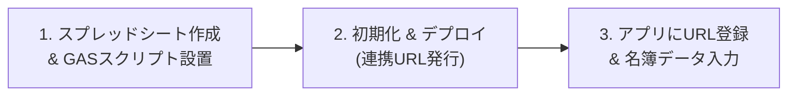

# 自治会員名簿管理システム：他自治会向け スプレッドシート側 設定・導入マニュアル

本資料は、自治会員名簿管理システムを**新しく別の自治会・町内会へ導入する際のスプレッドシート側の準備・設定手順**をまとめたガイドです。

本システムは、**Webアプリ本体（無料・共通利用）** と **各自治体のGoogleスプレッドシート（個別データベース）** を連携させて動作します。  
サーバーの契約や追加費用は一切かからず、Googleアカウント（無料）が1つあれば、**約15〜20分**でゼロからセットアップ可能です。

---

## 📌 全体の流れ（3ステップ）

---

## STEP 1：Googleスプレッドシートの作成とスクリプト設置

### 1-1. スプレッドシートを新規作成する
1. [Googleドライブ](https://drive.google.com/) を開きます（※自治会の共有Googleアカウント推奨）。
2. 左上の「＋ 新規」＞「Googleスプレッドシート」をクリックします。
3. シート名をわかりやすい名前に変更します（例: `〇〇自治会員名簿_2026`）。

### 1-2. Google Apps Script（GAS）エディタを開く
1. メニューバーの **「拡張機能」** ＞ **「Apps Script」** をクリックします。
2. 開いた画面のプロジェクト名（初期値: `無題のプロジェクト`）を `名簿連携API` などに変更します。

### 1-3. スクリプト（`Code.js`）を貼り付ける
1. 左側のファイル一覧で `コード.gs` が開いていることを確認します。
2. エディタ内にある初期コード（`function myFunction() { ... }`）を**すべて削除**して空にします。
3. 本システムの [`Code.js`](https://raw.githubusercontent.com/jack91709991-stack/community-roster/main/Code.js) の内容を**最初から最後まで丸ごとコピー**し、エディタに貼り付けます。
4. エディタ上部の **フロッピーアイコン（💾 プロジェクトを保存）** をクリックします。

---

## STEP 2：初回初期化（3つのシートを自動作成）

貼り付けたスクリプトには、必要なシート（「会員名簿」「入会申込_フォーム連携」「システム設定」）を自動構築する機能が備わっています。

### 2-1. 初期化関数を実行する
1. Apps Scriptエディタ上部の関数選択プルダウン（「実行」ボタンの左隣）から **`initSheets`** を選択します。
2. **「実行」** ボタン（▶）をクリックします。

### 2-2. 初回アクセスの承認（Googleのセキュリティ画面）
初回実行時のみ、「承認が必要です」というポップアップが表示されます。以下の手順で許可します：
1. **「権限を確認」** をクリック。
2. ご自身のGoogleアカウントを選択。
3. 「Google はこのアプリを検証していません」という警告画面が出たら、左下の **「詳細」**（または「Advanced」）をクリック。
4. 下部に表示される **「〇〇（安全ではないページ）に移動」** をクリック。
5. 要求される権限（スプレッドシートの閲覧・編集）を確認し、右下の **「許可」** をクリック。

> **成功の確認**:  
> スプレッドシートの画面に戻ると、下部のタブに以下の3つのシートが自動生成され、見出し（ヘッダー行）が青・緑・グレーで綺麗に設定されていることを確認してください。
> - 📘 **「会員名簿」**
> - 📗 **「入会申込_フォーム連携」**
> - ⚙️ **「システム設定」**

---

## STEP 3：ウェブアプリとしてデプロイ（連携URLの発行）

Webアプリ（スマホやPCの画面）とスプレッドシートを通信させるためのURLを発行します。

1. Apps Scriptエディタ右上の青い **「デプロイ」** ボタン ＞ **「新しいデプロイ」** をクリックします。
2. 左側の歯車アイコン（種類の選択）をクリックし、**「ウェブアプリ」** を選択します。
3. 次のように各項目を設定します：
   - **説明**: `自治会名簿API v1`（任意）
   - **次のユーザーとして実行**: **`自分（ご自身のアドレス）`**
   - **アクセスできるユーザー**: **`全員`** *(※重要)*
     > ⚠️ **注意**: 「全員」を選択しないと、ログインしていない端末やスマホアプリからデータが取得できなくなります。  
     > 本システムは独自に「役員合言葉」「管理者合言葉」による暗号照合プロテクトを行っているため、「全員」に設定しても合言葉を知らない第三者から個人情報が見られることはありません。
4. 右下の **「デプロイ」** をクリックします。
5. 画面に表示された **「ウェブアプリのURL」**（`https://script.google.com/macros/s/XXXX.../exec`）の横にある **「コピー」** をクリックします。

---

## STEP 4：自治会ごとの個別カスタマイズ（「システム設定」シート）

作成された **「システム設定」** シートを開き、それぞれの自治会の運用に合わせて設定値を変更します。

| 設定項目キー | 設定値（B列）の例 | 説明 |
| :--- | :--- | :--- |
| `communityName` | `緑が丘自治会` | 自治会・町内会名（アプリのタイトル等に表示） |
| `passcode` | `roster2026` | **役員用合言葉**（一般役員・班長の閲覧、集金チェック、帳票印刷用） |
| `adminPasscode` | `admin2026` | **管理者用合言葉**（会長・総務などの名簿編集・削除・設定変更用） |
| `blocks` | `[{"id":"blk-1","name":"1ブロック","bans":["1班","2班"]}, ...]` | ブロックと班の編成（※アプリ画面の「設定」タブから画面操作でも設定可能） |
| `roles` | `["一般会員","会長","副会長","ブロック長","会計", ...]` | 役職・係の一覧（※アプリ画面の「設定」タブからも追加可能） |

> 💡 **合言葉設定のコツ**:  
> 英数字を組み合わせた簡単なパスコード（例: `midori2026`、`admin8888` など）を設定してください。  
> 毎年4月の総会・役員交代時にここを変更するだけで、旧役員のスマホからのアクセスを一括遮断できます。

---

## STEP 5：Webアプリとの接続テスト

1. 自治会員名簿管理システムのWebアプリURLを開きます：  
   🔗 **[https://jack91709991-stack.github.io/community-roster/](https://jack91709991-stack.github.io/community-roster/)**
2. 画面右上または下部ナビゲーションの **「⚙️ 設定」** タブを開きます。
3. 画面右上の **「🔒 未認証」** ボタンを押し、STEP 4で決めた **「管理者合言葉」** を入力してログインします（👑 アイコンに変化します）。
4. 設定画面内の **「Google Apps Script Web App URL」** 入力欄に、STEP 3でコピーしたURLを貼り付けます。
5. **「保存して接続テスト」** ボタンをクリックします。
6. 右上の接続インジケーターが **「🟢 接続中」** に変わり、自治会名が表示されれば接続完了です！

---

## STEP 6：既存名簿データの登録（「会員名簿」シートの入力）

既存のExcel名簿や紙の名簿がある場合は、**「会員名簿」** シートに直接データをコピー＆ペースト（または手入力）します。

### 「会員名簿」シートの列構成（全16列）

| 列番号 | 列名（1行目） | 入力例 / 選択肢 | 必須 | 備考 |
| :---: | :--- | :--- | :---: | :--- |
| A | **会員ID** | `M001`, `01-01` など | 必須 | 半角英数字推奨。重複しない一意の番号 |
| B | **班** | `1班`, `3班` など | 必須 | 「システム設定」で定義した班名と一致させる |
| C | **氏名** | `山田 太郎` | 必須 | 世帯主の氏名 |
| D | **フリガナ** | `ヤマダ タロウ` | 任意 | 全角カタカナ推奨 |
| E | **電話番号** | `090-1234-5678` | 任意 | 自宅または携帯。**※書式は「書式なしテキスト」推奨** |
| F | **電話番号2** | `03-1234-5678` | 任意 | 固定電話、配偶者携帯など |
| G | **メールアドレス** | `taro@example.com` | 任意 | 連絡用メール |
| H | **住所** | `緑が丘1-2-3` | 必須 | 番地、建物名、部屋番号 |
| I | **役員** | `一般会員`, `会長`, `会計` | 必須 | 「システム設定」の役員一覧から入力（初期値: `一般会員`） |
| J | **班長** | `班長`, `なし` | 必須 | 今年度班長を担当している場合は `班長`、それ以外は `なし` |
| K | **会費状況** | `納入済`, `未納`, `免除` | 必須 | 今年度の会費（初期値: `未納`） |
| L | **回覧方法** | `LINE`, `紙` | 必須 | 回覧板の受け取り希望（初期値: `紙`） |
| M | **加入日** | `2024-04-01` | 任意 | `YYYY-MM-DD` 形式 |
| N | **会員状態** | `現役`, `休会`, `転出退会` | 必須 | 通常は `現役` |
| O | **備考** | `2026年4月入会希望` など | 任意 | 自由記入欄 |
| P | **更新日時** | `2026-10-01 10:00:00` | 自動 | アプリで編集した際に自動更新されます |

> ⚠️ **電話番号の注意点**:  
> スプレッドシートにハイフンなしで `09012345678` と打つと、先頭の `0` が消えてしまうことがあります。  
> 列E・列F全体を選択し、メニューの **「表示形式」＞「数字」＞「書式なしテキスト」** に設定しておくと安心です。

---

## STEP 7：Googleフォーム入会申込との連携（任意・おすすめ）

新住民からの入会申込をオンラインで受け付け、アプリの「入会申請受付」画面でワンタップ承認・名簿追加したい場合の手順です。

### 7-1. Googleフォームを作成する
Googleドライブで「Googleフォーム」を新規作成し、以下の項目を作成します：

1. **氏名**（記述式・必須）
2. **氏名フリガナ**（記述式）
3. **住所**（記述式・必須）
4. **電話番号**（記述式・必須）
5. **メールアドレス**（記述式）
6. **入会希望(年)**（記述式。例: 2026）
7. **入会希望(月)**（記述式またはプルダウン。例: 4）
8. **回覧板への電話番号の掲載**（ラジオボタン: `1.掲載可` / `2.掲載不可`）
9. **回覧板の受け取り方法を選択**（ラジオボタン: `1.紙の回覧は不要とし、LINE（ライン）通知による回覧を希望する` / `2.紙での回覧を希望する`）
10. **その他・備考**（段落・任意）

### 7-2. フォームの回答先を名簿スプレッドシートに紐付ける
1. Googleフォームの **「回答」** タブを開きます。
2. スプレッドシートアイコンの右側にある **「スプレッドシートにリンク」** をクリックします。
3. **「既存のスプレッドシートを選択」** を選び、STEP 1で作成した自治会名簿スプレッドシートを選択します。
4. スプレッドシート内に **「フォームの回答 1」** シートが自動追加されます。

### 7-3. フォーム回答シートに「ステータス」列を追加する
1. スプレッドシートの「フォームの回答 1」シートを開きます。
2. ヘッダー行の最後の列の隣に、**`ステータス`** と入力します。
3. （過去の回答データで、すでに名簿に登録済みの行がある場合は、そのステータス列に `承認済` と入力しておくと、アプリの未処理申請一覧に出てこなくなります）。

> 💡 **自動認識機能**:  
> 本システムのGASは、フォームが連携された「フォームの回答 1」シートを自動検出し、項目順や文言のブレ（「電話番号」「お電話番号」等）を自動判定してアプリの「入会申請受付」タブに届けてくれます。

---

## 🔒 セキュリティと運用管理のアドバイス

### 1. 役員交代・年度更新のとき
- 個人アカウントの権限付与や削除は不要です。
- 管理者が「システム設定」シート（またはアプリの設定画面）で、**`passcode`（役員合言葉）** と **`adminPasscode`（管理者合言葉）** を新年度のものに書き換えるだけで、旧役員のスマホからはアクセスできなくなります。

### 2. バックアップ
- Googleスプレッドシートのメニュー「ファイル」＞「変更履歴」＞「変更履歴を表示」から、いつでも過去の状態に戻せます。
- 定期的に「ファイル」＞「ダウンロード」＞「Microsoft Excel (.xlsx)」でパソコンにローカル保存しておくと万全です。

### 3. 一般役員への案内方法
一般役員や班長には、以下の3点だけを連絡します：
1. **アプリURL**: `https://jack91709991-stack.github.io/community-roster/`
2. **役員合言葉**: 例 `roster2026`
3. **GAS Web App URL**: 例 `https://script.google.com/macros/s/.../exec`
   （※管理者がアプリの設定画面から「共有用QRコード」や設定エクスポートを行うことも可能です）
